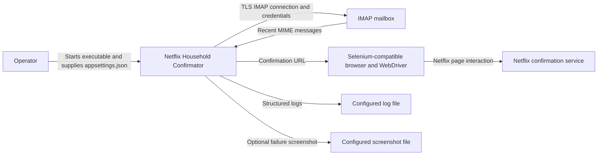
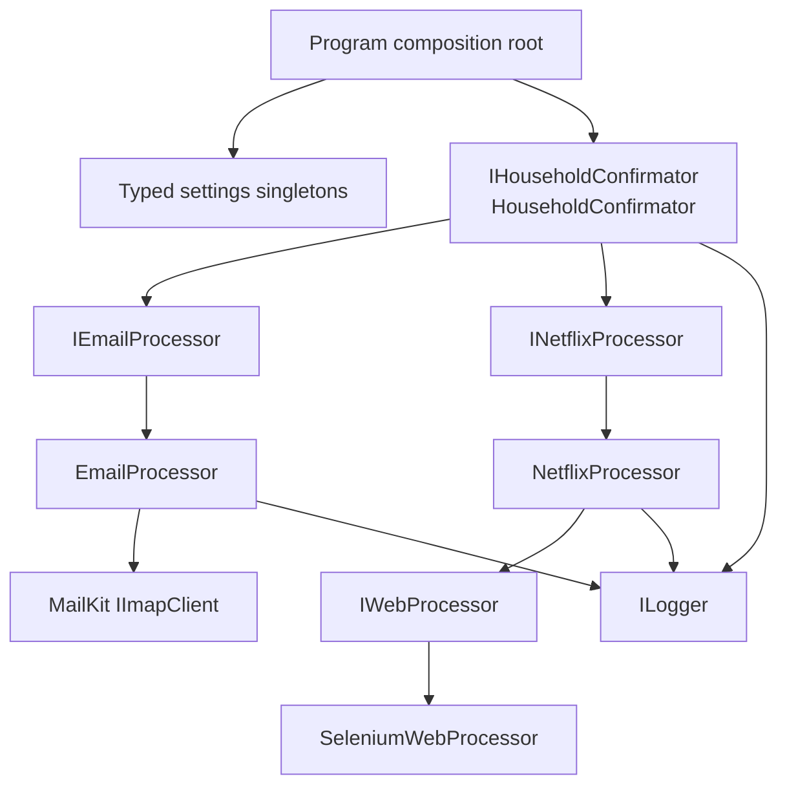
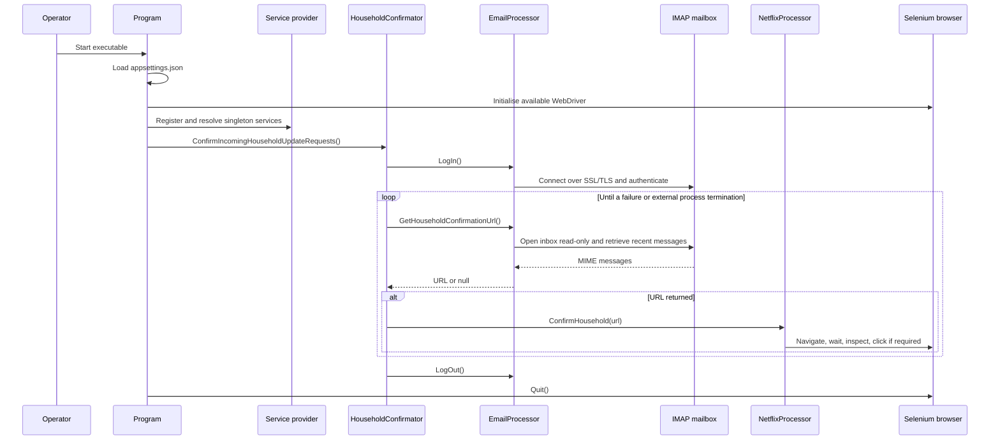
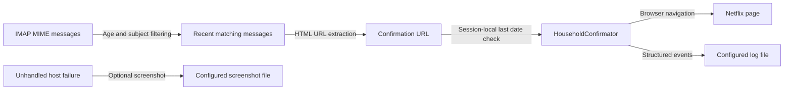
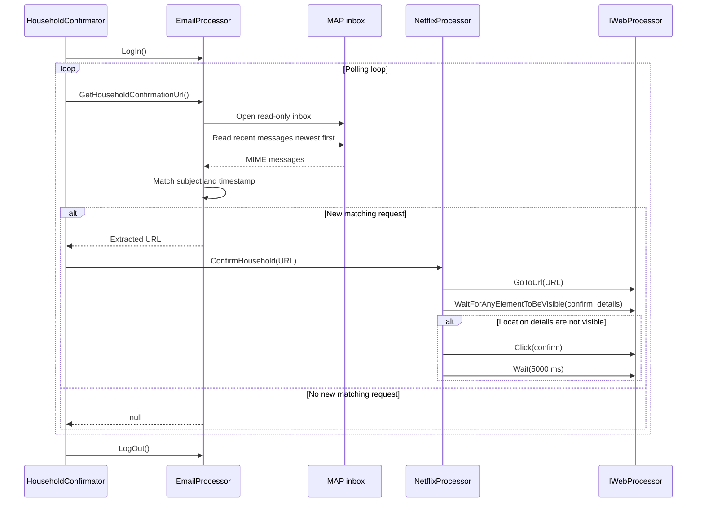
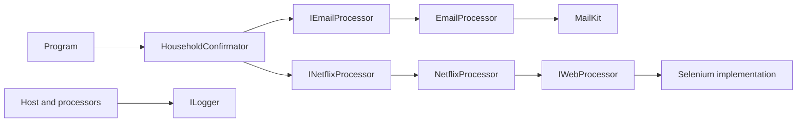

# Netflix Household Confirmator Architecture

This document records the current architecture of the Netflix Household Confirmator .NET console application. It covers the executable, its IMAP and browser-automation boundaries, configuration, operational behaviour, and unit-test verification; it does not describe a target architecture.

## 📑 Table of Contents

- [Purpose](#purpose)
- [System Context](#system-context)
- [Architectural Style](#architectural-style)
- [Runtime Flow](#runtime-flow)
- [Components](#components)
- [Architectural Areas](#architectural-areas)
  - [Application Host](#application-host)
  - [Service Layer](#service-layer)
  - [Configuration And Logging](#configuration-and-logging)
  - [Unit Tests](#unit-tests)
- [Data Architecture](#data-architecture)
- [Interfaces And Integrations](#interfaces-and-integrations)
- [Key Flows](#key-flows)
  - [Household Request Confirmation](#household-request-confirmation)
- [Domain-Specific Concerns](#domain-specific-concerns)
- [Cross-Cutting Concerns](#cross-cutting-concerns)
  - [Security And Privacy](#security-and-privacy)
  - [Error Handling](#error-handling)
  - [Observability](#observability)
  - [Configuration](#configuration)
  - [Concurrency And Resource Use](#concurrency-and-resource-use)
- [Dependency Direction And Rules](#dependency-direction-and-rules)
- [External Dependencies](#external-dependencies)
- [Deployment And Operations](#deployment-and-operations)
- [Compatibility Contracts](#compatibility-contracts)
- [Testing And Verification](#testing-and-verification)
- [Design Constraints](#design-constraints)
- [Extension Points](#extension-points)
  - [Email Processor](#email-processor)
  - [Netflix Processor](#netflix-processor)
  - [Household Confirmator](#household-confirmator)
- [Source Map](#source-map)
- [Related Documentation](#related-documentation)

## 🎯 Purpose

The application monitors a configured IMAP inbox for Netflix household update messages and uses Selenium-backed browser automation to confirm each detected request. This document defines the current ownership boundaries and runtime contracts for maintainers and contributors. It also records operational limitations that are not apparent from the public interfaces alone.

## 🌐 System Context

The executable is the system boundary. An operator supplies configuration and starts one long-running process. The process reads recent messages from an external IMAP mailbox, extracts a Netflix confirmation URL, and navigates an external browser to the confirmation page. The application does not persist domain state in a database or expose an inbound API.



The principal external boundaries are:
- **Operator and filesystem:** The operator starts the executable and provides `appsettings.json`; the process writes configured logs and, optionally, a crash screenshot.
- **IMAP mailbox:** `EmailProcessor` owns the outbound TLS connection, authentication, read-only inbox access, message-age filtering, subject matching, and URL extraction.
- **Netflix and browser runtime:** `NetflixProcessor` owns browser navigation and selector-based interaction through `IWebProcessor`; Netflix owns the page and confirmation semantics.
- **Logging and diagnostics:** `NuciLogger` receives application events; the configured file path and screenshot location are external filesystem outputs.

## 🏗️ Architectural Style

The application is a single-process console pipeline with dependency injection and ports-and-adapters boundaries. `Program` is the composition root, `HouseholdConfirmator` is the orchestration service, and email and browser operations are isolated behind `IEmailProcessor` and `INetflixProcessor`. Concrete adapters use MailKit and NuciWeb Selenium implementations.

The process is also a polling pipeline: it authenticates once, repeatedly scans recent inbox messages, and invokes browser confirmation when a matching URL is returned. This produces simple ownership and substitution boundaries, but it also means the process has no built-in stop signal, scheduler, queue, or horizontal coordination.



The principal architecture boundaries are:
- **Composition root:** `Program` loads settings, creates the WebDriver, registers singleton services, and owns process-level cleanup.
- **Orchestration:** `HouseholdConfirmator` owns mailbox session ordering, polling, delegation, and logout in `finally`.
- **Integration processors:** `EmailProcessor` and `NetflixProcessor` own their respective external protocols and translate failures into logs or propagated exceptions according to their current implementations.
- **Infrastructure contracts:** MailKit, NuciLog, and NuciWeb provide concrete transport, logging, and browser capabilities behind application-facing interfaces.

## 🔄 Runtime Flow



The principal runtime sequence is:
1. `Program.Main` binds `BotSettings`, `DebugSettings`, `ImapSettings`, and `NuciLoggerSettings` from `appsettings.json`.
2. The composition root creates one available WebDriver and registers application services and settings as singletons.
3. `HouseholdConfirmator` logs into IMAP and enters an unbounded polling loop.
4. `EmailProcessor` scans recent messages, selects a subject match newer than the last processed matching message, and extracts a URL from the HTML body.
5. When a non-null value is returned, `NetflixProcessor` navigates to it and conditionally clicks the Netflix confirmation control.
6. Failures are logged and either propagated to the host or swallowed by the processor that owns them; the host quits the browser and records shutdown in `finally`.

## 🧩 Components

| Component | Responsibility | Principal Dependencies | Lifetime or Ownership |
|-----------|----------------|------------------------|-----------------------|
| `Program` | Loads configuration, composes services, owns the WebDriver, and handles process-level failure and shutdown | Microsoft configuration and DI; NuciLog; Selenium initialiser | Process lifetime; composition root |
| `HouseholdConfirmator` | Logs into IMAP, polls for URLs, delegates confirmation, and logs out | `IEmailProcessor`, `INetflixProcessor`, `ILogger` | Singleton resolved by the host |
| `EmailProcessor` | Connects to IMAP, scans recent messages, filters matching subjects, extracts URLs, and tracks the last processed message time | `ImapSettings`, `ILogger`, `IImapClient` | Singleton; owns the injected IMAP client session |
| `NetflixProcessor` | Navigates to the confirmation URL and confirms the household through page selectors | `IWebProcessor`, `ILogger` | Singleton; uses the process-owned WebDriver |
| `NuciLogger` | Emits structured lifecycle, progress, failure, and diagnostic events | `NuciLoggerSettings` | Singleton registered by the host |
| `SeleniumWebProcessor` | Provides browser interaction primitives used by `NetflixProcessor` | Process-owned `IWebDriver` | Singleton adapter over the WebDriver |

## 🗂️ Architectural Areas

### Application Host

Paths:
- [NetflixHouseholdConfirmator/Program.cs](NetflixHouseholdConfirmator/Program.cs)
- [NetflixHouseholdConfirmator/NetflixHouseholdConfirmator.csproj](NetflixHouseholdConfirmator/NetflixHouseholdConfirmator.csproj)

Responsibilities:
- Load JSON configuration and bind typed settings.
- Initialise the available browser driver before service composition.
- Register application services and integration adapters in the DI container.
- Translate unhandled failures into fatal logs and optional screenshots.
- Quit the WebDriver during process shutdown.

Boundary rules:
- The composition root owns concrete registrations and process-level resources.
- Runtime services consume interfaces and typed settings rather than constructing the application graph.

### Service Layer

Paths:
- [NetflixHouseholdConfirmator/Service/HouseholdConfirmator.cs](NetflixHouseholdConfirmator/Service/HouseholdConfirmator.cs)
- [NetflixHouseholdConfirmator/Service/IHouseholdConfirmator.cs](NetflixHouseholdConfirmator/Service/IHouseholdConfirmator.cs)
- [NetflixHouseholdConfirmator/Service/Processors/EmailProcessor.cs](NetflixHouseholdConfirmator/Service/Processors/EmailProcessor.cs)
- [NetflixHouseholdConfirmator/Service/Processors/IEmailProcessor.cs](NetflixHouseholdConfirmator/Service/Processors/IEmailProcessor.cs)
- [NetflixHouseholdConfirmator/Service/Processors/NetflixProcessor.cs](NetflixHouseholdConfirmator/Service/Processors/NetflixProcessor.cs)
- [NetflixHouseholdConfirmator/Service/Processors/INetflixProcessor.cs](NetflixHouseholdConfirmator/Service/Processors/INetflixProcessor.cs)

Responsibilities:
- Orchestrate the mailbox-to-browser confirmation process.
- Encapsulate IMAP message selection and confirmation URL extraction.
- Encapsulate Netflix page interaction and selector decisions.

Boundary rules:
- `HouseholdConfirmator` coordinates processors but does not implement IMAP or browser details.
- Processor interfaces are the substitution boundaries used by orchestration tests.

### Configuration And Logging

Paths:
- [NetflixHouseholdConfirmator/Configuration/BotSettings.cs](NetflixHouseholdConfirmator/Configuration/BotSettings.cs)
- [NetflixHouseholdConfirmator/Configuration/DebugSettings.cs](NetflixHouseholdConfirmator/Configuration/DebugSettings.cs)
- [NetflixHouseholdConfirmator/Configuration/ImapSettings.cs](NetflixHouseholdConfirmator/Configuration/ImapSettings.cs)
- [NetflixHouseholdConfirmator/Logging/MyLogInfoKey.cs](NetflixHouseholdConfirmator/Logging/MyLogInfoKey.cs)
- [NetflixHouseholdConfirmator/Logging/MyOperation.cs](NetflixHouseholdConfirmator/Logging/MyOperation.cs)
- [NetflixHouseholdConfirmator/appsettings.json](NetflixHouseholdConfirmator/appsettings.json)

Responsibilities:
- Represent browser, IMAP, diagnostic, and logging settings.
- Define operation categories and structured log information keys.
- Supply runtime configuration from the installation directory.

Boundary rules:
- Credentials are configuration inputs and are not architectural domain state.
- The password is passed to IMAP authentication but is not included in the logger information assembled by `EmailProcessor`.

### Unit Tests

Paths:
- [NetflixHouseholdConfirmator.UnitTests](NetflixHouseholdConfirmator.UnitTests)
- [NetflixHouseholdConfirmator.UnitTests/Service](NetflixHouseholdConfirmator.UnitTests/Service)
- [NetflixHouseholdConfirmator.UnitTests/Configuration](NetflixHouseholdConfirmator.UnitTests/Configuration)
- [NetflixHouseholdConfirmator.UnitTests/Logging](NetflixHouseholdConfirmator.UnitTests/Logging)

Responsibilities:
- Verify orchestration ordering and cleanup with Moq substitutes.
- Verify IMAP filtering, extraction, authentication, and disposal behaviour.
- Verify browser selector and failure behaviour.
- Verify configuration and logging value contracts.

Boundary rules:
- Tests isolate external mailbox and browser integrations; the suite does not require a live mailbox or browser.

## 💾 Data Architecture

The application has no database or durable domain store. Its meaningful state is held in process memory or emitted to configured filesystem outputs. IMAP remains the source of incoming request data, while the browser and logger are output boundaries.



| Data or Store | Owner | Representation and Storage | Lifecycle or Consistency |
|---------------|-------|----------------------------|--------------------------|
| IMAP messages | `EmailProcessor` reads; IMAP provider persists | `MimeMessage` values retrieved from the read-only inbox | Recent messages only; scanning stops at the first message beyond `MaxEmailAge` |
| Last confirmation email timestamp | `EmailProcessor` | Private `DateTime` field in process memory | Initialised at process start; prevents a matching message at or before the recorded timestamp from being returned again |
| Confirmation URL | `EmailProcessor` produces; `HouseholdConfirmator` consumes | String extracted from HTML using a fixed regular expression | Exists for the current polling iteration and is passed to `NetflixProcessor` |
| Credentials and settings | `Program` binds; processors consume | Typed settings objects populated from `appsettings.json` | Process lifetime; changes require restart |
| Logs | `NuciLogger` | Structured events sent to configured output, including optional file output | Retention is external to the application |
| Crash screenshot | `Program` | Image saved beside the configured log file when enabled | Retention is external and manual |

## 🔌 Interfaces And Integrations

| Interface or Integration | Direction | Contract | Owner | Failure Semantics |
|--------------------------|-----------|----------|-------|-------------------|
| `IHouseholdConfirmator` | Inbound from host | `ConfirmIncomingHouseholdUpdateRequests()` | `HouseholdConfirmator` | Login and polling failures are logged and propagated; logout runs in `finally` after polling starts |
| `IEmailProcessor` | Outbound from orchestration | `LogIn`, `GetHouseholdConfirmationUrl`, `LogOut` | `EmailProcessor` | Connection, authentication, and disconnection failures are logged and propagated |
| MailKit `IImapClient` | Outbound | SSL/TLS IMAP connection, authentication, read-only inbox access | `EmailProcessor` | MailKit exceptions are logged at the operation boundary and propagated |
| `INetflixProcessor` | Outbound from orchestration | `ConfirmHousehold(string confirmationUrl)` | `NetflixProcessor` | Browser automation exceptions are logged and swallowed by the processor; a success log is subsequently emitted by the current implementation |
| `IWebProcessor` | Outbound | URL navigation, element visibility wait, visibility query, click, and fixed wait | `NetflixProcessor` | Exceptions are handled by `NetflixProcessor` |
| `ILogger` | Outbound | NuciLog operation and status events | Host and processors | Logging failures are not translated by the application |

## 🔀 Key Flows

### Household Request Confirmation



`EmailProcessor` scans from the newest inbox message backwards and stops when message age exceeds `MaxEmailAge`. It requires a case-sensitive subject containing `How to update your Netflix Household`, then requires the received timestamp to be newer than its session-local `lastConfirmationEmailDateTime`. The HTML body is reduced to a URL matching the `UPDATE_HOUSEHOLD_REQUESTED_OTP_CTA` path pattern. The orchestration layer forwards every non-null return value, including empty or whitespace strings, because the current contract tests treat any non-null value as a request.

## ⚙️ Domain-Specific Concerns

Netflix household confirmation is coupled to the email subject, URL marker, and page selectors. `NetflixProcessor` waits for either the confirmation button or location-details element. It clicks the button only when location details are not visible, then waits five seconds for the page operation to settle. Changes to Netflix email or page markup therefore require coordinated updates to `EmailProcessor`, `NetflixProcessor`, and their tests.

## 🧵 Cross-Cutting Concerns

### Security And Privacy

The IMAP server, username, and password cross the application-to-mailbox trust boundary. The current configuration stores these values in `appsettings.json`; the repository file contains placeholders, and genuine credentials must be supplied only in the deployment environment. The process does not request Netflix credentials; it uses the URL extracted from the mailbox. The logger records server, port, and username for connection diagnostics, while the password is excluded from `LogInfo` values assembled by `EmailProcessor`.

Email content and extracted URLs remain in process memory during polling. Logs and crash screenshots can contain operational context or browser state, so filesystem access and retention are operator responsibilities. The application has no authentication or authorisation layer for inbound callers because it exposes no inbound service endpoint.

### Error Handling

`EmailProcessor` logs connection, authentication, and disconnection failures and rethrows them. `HouseholdConfirmator` logs polling or confirmation exceptions, rethrows them, and guarantees logout after successful login and listener initialisation. `NetflixProcessor` catches browser interaction exceptions and logs them without rethrowing; its subsequent success log is therefore not a verified external confirmation. `Program` catches aggregate and general exceptions, records fatal diagnostics, optionally saves a screenshot, quits the WebDriver, and records shutdown.

### Observability

`NuciLogger` records startup, shutdown, IMAP login and logout, polling, household confirmation, and failure states using `MyOperation` and `OperationStatus`. IMAP server, port, and username are attached where relevant. File logging is controlled by `NuciLoggerSettings`; the application does not expose metrics, traces, health endpoints, or a remote diagnostic channel.

### Configuration

| Configuration Area | Source | Responsibility | Override or Secret Policy |
|--------------------|--------|----------------|---------------------------|
| Browser automation | `BotSettings` in [NetflixHouseholdConfirmator/appsettings.json](NetflixHouseholdConfirmator/appsettings.json) | Page-load timeout | Bound at startup; restart required after changes |
| IMAP access and filtering | `ImapSettings` in [NetflixHouseholdConfirmator/appsettings.json](NetflixHouseholdConfirmator/appsettings.json) | Server, port, credentials, and maximum message age | Bound at startup; password is a deployment secret despite its current file-based source |
| Debug diagnostics | `DebugSettings` in [NetflixHouseholdConfirmator/appsettings.json](NetflixHouseholdConfirmator/appsettings.json) | Visible versus headless browser and screenshot filename | Bound at startup; empty screenshot filename disables capture |
| Logging | `NuciLoggerSettings` in [NetflixHouseholdConfirmator/appsettings.json](NetflixHouseholdConfirmator/appsettings.json) | Minimum level, file destination, and file-output activation | Bound at startup; file output is controlled by `isFileOutputEnabled` |

### Concurrency And Resource Use

The application uses one synchronous polling loop, one singleton `EmailProcessor`, one singleton `NetflixProcessor`, one IMAP client session, and one process-owned WebDriver. No application-managed parallelism, queue, or backpressure mechanism exists. The polling loop has no delay and therefore repeatedly scans the inbox while no request is available. A single process is the assumed deployment unit; running multiple instances against the same mailbox can produce duplicate external confirmations because coordination is not implemented.

## 🧭 Dependency Direction And Rules

The dependency direction points from the host to orchestration, from orchestration to application-facing processor interfaces, and from concrete processors to external integration abstractions or libraries. The composition root is the only verified location that assembles concrete implementations.



The principal dependency rules are:
- `Program` owns concrete service registration, settings binding, WebDriver initialisation, and process cleanup.
- `HouseholdConfirmator` depends on processor interfaces and does not depend directly on MailKit or Selenium selectors.
- `EmailProcessor` owns IMAP message selection and URL extraction; `NetflixProcessor` owns browser selectors and confirmation interaction.
- Tests depend on public contracts and injected substitutes rather than live external services.
- External integrations must remain behind their current processor or adapter boundary when replacing MailKit or browser automation.

## 📦 External Dependencies

| Dependency | Responsibility | Integration Boundary | Architectural Consequence |
|------------|----------------|----------------------|---------------------------|
| MailKit and `MailKit.Net` | IMAP transport and MIME message access | `EmailProcessor` and `IImapClient` | Mailbox protocol behaviour and exceptions shape the polling contract |
| Microsoft.Extensions.Configuration | JSON configuration loading and binding | `Program.LoadConfiguration` | Settings are bound at startup from the working-directory configuration file |
| Microsoft.Extensions.DependencyInjection | Service composition | `Program.CreateIOC` | Runtime services are registered as singletons and resolved from one provider |
| NuciLog and NuciLog.Core | Structured logging contracts and implementation | `ILogger` and `NuciLogger` | Operation and status events are the principal diagnostic interface |
| NuciWeb, NuciWeb.Automation, and NuciWeb.Automation.Selenium | Browser interaction abstractions and Selenium implementation | `IWebProcessor` and WebDriver initialisation | Confirmation depends on a compatible browser, WebDriver, and current Netflix selectors |
| .NET 10.0 runtime | Console process and base runtime | Executable host | Deployment requires a compatible .NET 10 environment or published runtime package |

## 🚀 Deployment And Operations

The deployment unit is a single .NET 10 console executable with `appsettings.json` beside it. The release script delegates publication to an external maintainer script, while continuous integration restores, builds, and tests on Ubuntu for pushes and pull requests targeting `master`. Runtime operation requires network access to the configured IMAP server and Netflix, plus a compatible browser and WebDriver.

| Concern | Current Design | Architectural Consequence |
|---------|----------------|---------------------------|
| Process topology | One long-running console process | Operators supervise process termination and restart |
| Persistent state | No database or checkpoint store | Duplicate suppression lasts only for the current process session |
| Mailbox access | One authenticated IMAP session | Mailbox availability and credentials are startup dependencies |
| Browser access | One process-owned WebDriver | Browser and driver failures affect confirmation attempts and shutdown diagnostics |
| Scaling | No coordination or distributed lock | Multiple instances are not a supported consistency model |
| Release | `release.sh` invokes an external .NET 10 release script | Release behaviour depends on the remote helper and network availability |
| Diagnostics | Configurable logs and optional crash screenshot | Operators must manage filesystem permissions, retention, and sensitive output |

## 🛡️ Compatibility Contracts

| Contract | Owner | Invariant | Verification | Change Policy |
|----------|-------|-----------|--------------|---------------|
| Configuration section names | `Program` and typed settings | `BotSettings`, `DebugSettings`, `ImapSettings`, and `NuciLoggerSettings` bind from matching JSON sections | Configuration tests and startup execution | Preserve section and property names or update deployment documentation and tests together |
| Email subject and URL marker | `EmailProcessor` | Matching remains case-sensitive and requires the household subject text and `UPDATE_HOUSEHOLD_REQUESTED_OTP_CTA` URL marker | `EmailProcessorTests` | Coordinate changes with the received Netflix email format |
| Netflix selectors | `NetflixProcessor` | Confirmation and location-details XPath selectors identify the expected page controls | `NetflixProcessorTests` and compatible browser verification | Update selectors and tests together when Netflix markup changes |
| Processor interfaces | Service layer | Orchestration calls login, polling, confirmation, and logout in the current order | `HouseholdConfirmatorTests` | Preserve method signatures and lifecycle order for adapters and tests |
| Runtime resource lifecycle | `Program` and `HouseholdConfirmator` | IMAP logout and WebDriver quit occur at their current ownership boundaries | Orchestration tests and manual shutdown verification | Changes require explicit cleanup tests |

## ✅ Testing And Verification

The repository contains a separate NUnit unit-test project referencing the executable project. Moq substitutes isolate IMAP, browser, and logger boundaries. Tests cover configuration and logging values, orchestration ordering and cleanup, IMAP connection and message selection, URL extraction, and browser selector behaviour. They do not verify live IMAP access, real Netflix markup, a real browser driver, or process signal handling.

Execute the principal automated verification with:

```bash
dotnet test
```

The CI-equivalent verification is:

```bash
dotnet restore
dotnet build --no-restore
dotnet test --no-build --verbosity normal
```

Coverage can be collected with:

```bash
dotnet test --collect:"XPlat Code Coverage" --results-directory NetflixHouseholdConfirmator.UnitTests/TestResults
```

## ⚠️ Design Constraints

- **Continuous synchronous polling:** The listener has an unbounded loop without a delay, cancellation token, scheduler, or queue; CPU and mailbox load are consequences of the current implementation.
- **Session-local duplicate suppression:** The last processed timestamp is held only in memory, so a restart can revisit messages that remain within the configured age window.
- **External selector coupling:** Email subject text, URL format, and Netflix XPath selectors are external compatibility contracts.
- **Single-process ownership:** The application has no distributed coordination or durable checkpoint, so concurrent instances are not a supported consistency model.
- **Failure-status ambiguity:** `NetflixProcessor` swallows browser exceptions and emits a success log afterwards, so a success event does not prove that Netflix accepted the request.
- **File-based secrets:** The current configuration contract reads the IMAP password from `appsettings.json`; deployment must protect that file and avoid committing genuine credentials.
- **External release helper:** Publication depends on a remote script retrieved by `release.sh`, which introduces an operational dependency outside this repository.

## 🔧 Extension Points

### Email Processor

1. Implement `IEmailProcessor` for an alternative mailbox or message source.
2. Register the implementation in `Program.CreateIOC` in place of `EmailProcessor`.
3. Add tests covering authentication or source initialisation, message selection, duplicate suppression, and cleanup.

The implementation must preserve the login, polling, URL-or-null, and logout lifecycle expected by `HouseholdConfirmator`.

### Netflix Processor

1. Implement `INetflixProcessor` for a changed confirmation mechanism or browser adapter.
2. Register the implementation in `Program.CreateIOC` in place of `NetflixProcessor`.
3. Add tests for navigation, confirmation-state detection, interaction, and failure logging.

The implementation receives a non-null value from the current orchestrator but must retain the existing `string` contract unless the orchestration interface is revised concurrently.

### Household Confirmator

1. Implement `IHouseholdConfirmator` for a different orchestration policy.
2. Register it in `Program.CreateIOC` in place of `HouseholdConfirmator`.
3. Preserve explicit ownership of mailbox login and logout, and verify failure propagation and cleanup ordering.

The host expects a synchronous `ConfirmIncomingHouseholdUpdateRequests` operation and owns process-level exception handling around it.

## 🗺️ Source Map

| Area | Path |
|------|------|
| Application host and project manifest | [NetflixHouseholdConfirmator/Program.cs](NetflixHouseholdConfirmator/Program.cs), [NetflixHouseholdConfirmator/NetflixHouseholdConfirmator.csproj](NetflixHouseholdConfirmator/NetflixHouseholdConfirmator.csproj) |
| Typed configuration | [NetflixHouseholdConfirmator/Configuration](NetflixHouseholdConfirmator/Configuration) |
| Orchestration and integrations | [NetflixHouseholdConfirmator/Service](NetflixHouseholdConfirmator/Service) |
| Logging vocabulary | [NetflixHouseholdConfirmator/Logging](NetflixHouseholdConfirmator/Logging) |
| Runtime configuration | [NetflixHouseholdConfirmator/appsettings.json](NetflixHouseholdConfirmator/appsettings.json) |
| Unit-test project | [NetflixHouseholdConfirmator.UnitTests](NetflixHouseholdConfirmator.UnitTests) |
| Continuous integration | [.github/workflows/dotnet.yml](.github/workflows/dotnet.yml) |
| Release publication | [release.sh](release.sh) |

## 📚 Related Documentation

- [README.md](README.md) covers installation, configuration, usage, compatibility, development commands, and project structure.
- [LICENSE](LICENSE) defines the repository licensing terms.
