# Dependencies

## External Dependencies

### Runtime Dependencies (NetflixHouseholdConfirmator)

| Package | Version | Purpose | License |
|---------|---------|---------|---------|
| `MailKit` | 4.18.1 | IMAP client for email retrieval | MIT |
| `MailKit.Net` | 2.0.0 | Network layer for MailKit | MIT |
| `Microsoft.Extensions.Configuration` | 10.0.12 | Configuration abstraction | MIT |
| `Microsoft.Extensions.Configuration.Binder` | 10.0.12 | POCO binding from configuration | MIT |
| `Microsoft.Extensions.Configuration.Json` | 10.0.12 | JSON configuration provider | MIT |
| `Microsoft.Extensions.DependencyInjection` | 10.0.12 | DI container | MIT |
| `NuciLog` | 1.2.1 | Structured logging framework | MIT |
| `NuciLog.Core` | 3.1.0 | Core logging abstractions | MIT |
| `NuciWeb` | 4.0.0 | Web automation abstractions | MIT |
| `NuciWeb.Automation` | 1.0.0 | Browser automation interfaces | MIT |
| `NuciWeb.Automation.Selenium` | 1.0.2 | Selenium implementation of automation | MIT |

### Test Dependencies (UnitTests & IntegrationTests)

| Package | Version | Purpose | License |
|---------|---------|---------|---------|
| `coverlet.collector` | 10.1.0 | Code coverage collection | MIT |
| `Microsoft.NET.Test.Sdk` | 18.10.1 | Test platform SDK | MIT |
| `Moq` | 4.21.0 | Mocking framework | BSD-3-Clause |
| `NUnit` | 5.0.0 | Test framework | MIT |
| `NUnit.Analyzers` | 4.15.0 | Roslyn analyzers for NUnit | MIT |
| `NUnit3TestAdapter` | 6.3.0 | NUnit test adapter for VS/Test SDK | MIT |

### Transitive Dependencies (Key)

| Package | Purpose | Via |
|---------|---------|-----|
| `MimeKit` | MIME message parsing | MailKit |
| `BouncyCastle.Cryptography` | TLS/cryptography | MailKit |
| `OpenQA.Selenium` | WebDriver API | NuciWeb.Automation.Selenium |
| `Selenium.WebDriver` | Browser automation | NuciWeb.Automation.Selenium |
| `System.Text.Json` | JSON serialization | Microsoft.Extensions.Configuration.Json |

## Internal Dependencies

### Project References

```
NetflixHouseholdConfirmator.UnitTests
    └── NetflixHouseholdConfirmator

NetflixHouseholdConfirmator.IntegrationTests
    └── NetflixHouseholdConfirmator
```

### Namespace Dependencies

```
NetflixHouseholdConfirmator (exe)
    ├── NetflixHouseholdConfirmator.Configuration
    ├── NetflixHouseholdConfirmator.Logging
    └── NetflixHouseholdConfirmator.Service
        ├── NetflixHouseholdConfirmator.Service.Processors

NetflixHouseholdConfirmator.UnitTests
    └── NetflixHouseholdConfirmator.UnitTests.Service.Processors

NetflixHouseholdConfirmator.IntegrationTests
    └── NetflixHouseholdConfirmator.IntegrationTests.Service
```

## Dependency Direction Rules

1. **Composition root only in `Program.cs`** — Concrete registrations (`AddSingleton<TImpl, TImpl>()`) only in `CreateIOC()`
2. **Services consume interfaces** — `HouseholdConfirmator` depends on `IEmailProcessor`, `INetflixProcessor`, `ILogger`
3. **Settings as singletons** — Typed settings POCOs registered as singletons, injected into processors
4. **No circular dependencies** — Layer ordering: Host → Orchestrator → Processors → External libraries

## Dependency Graph

```mermaid
flowchart TD
    subgraph "External Packages"
        MailKit[MailKit 4.18.1]
        MimeKit[MimeKit]
        NuciLog[NuciLog 1.2.1]
        NuciLogCore[NuciLog.Core 3.1.0]
        NuciWeb[NuciWeb 4.0.0]
        NuciWebAuto[NuciWeb.Automation 1.0.0]
        NuciWebSelenium[NuciWeb.Automation.Selenium 1.0.2]
        MSConfig[Microsoft.Extensions.Configuration*]
        MSDI[Microsoft.Extensions.DependencyInjection]
        Selenium[OpenQA.Selenium / Selenium.WebDriver]
    end

    subgraph "NetflixHouseholdConfirmator (exe)"
        Program[Program.cs]
        BotSettings[BotSettings]
        DebugSettings[DebugSettings]
        ImapSettings[ImapSettings]
        LoggerSettings[NuciLoggerSettings]
        Logger[ILogger / NuciLogger]
        WebDriver[IWebDriver]
        WebProcessor[IWebProcessor / SeleniumWebProcessor]
        Orchestrator[IHouseholdConfirmator / HouseholdConfirmator]
        EmailProcessor[IEmailProcessor / EmailProcessor]
        NetflixProcessor[INetflixProcessor / NetflixProcessor]
    end

    Program --> BotSettings
    Program --> DebugSettings
    Program --> ImapSettings
    Program --> LoggerSettings
    Program --> WebDriver
    Program --> Logger
    Program --> WebProcessor
    Program --> Orchestrator
    Program --> EmailProcessor
    Program --> NetflixProcessor

    Orchestrator --> EmailProcessor
    Orchestrator --> NetflixProcessor
    Orchestrator --> Logger

    EmailProcessor --> ImapSettings
    EmailProcessor --> Logger
    EmailProcessor --> MailKit
    EmailProcessor --> MimeKit

    NetflixProcessor --> WebProcessor
    NetflixProcessor --> Logger

    WebProcessor --> WebDriver
    WebProcessor --> NuciWebSelenium
    WebProcessor --> Selenium

    Logger --> NuciLog
    Logger --> NuciLogCore

    MailKit --> MimeKit
    MailKit --> BouncyCastle[BouncyCastle.Cryptography]

    NuciWebSelenium --> NuciWebAuto
    NuciWebSelenium --> NuciWeb
    NuciWebSelenium --> Selenium
```



## Version Compatibility

| Component | Target Framework | Notes |
|-----------|------------------|-------|
| All projects | `net10.0` | .NET 10.0 |
| MailKit | 4.18.1 | Compatible with .NET 10 |
| NuciLog | 1.2.1 | Compatible with .NET 10 |
| NuciWeb | 4.0.0 | Compatible with .NET 10 |
| Selenium | Via NuciWeb | Version determined by NuciWeb.Automation.Selenium |

## License Compliance

All external dependencies use permissive licenses (MIT, BSD-3-Clause). No copyleft dependencies.

## Security Considerations

- **MailKit** handles TLS negotiation — keep updated for security patches
- **NuciWeb/Selenium** controls browser — WebDriver must be from trusted source
- **Configuration** contains IMAP password — protect `appsettings.json` filesystem access
- **No telemetry** — Application does not send data to maintainers

## Updating Dependencies

```bash
# Check for outdated packages
dotnet list NetflixHouseholdConfirmator/NetflixHouseholdConfirmator.csproj package --outdated

# Update a specific package
dotnet add NetflixHouseholdConfirmator/NetflixHouseholdConfirmator.csproj package MailKit --version <new-version>

# Update all (use with caution)
dotnet add NetflixHouseholdConfirmator/NetflixHouseholdConfirmator.csproj package MailKit
```

Run tests after any dependency update:
```bash
dotnet test
```