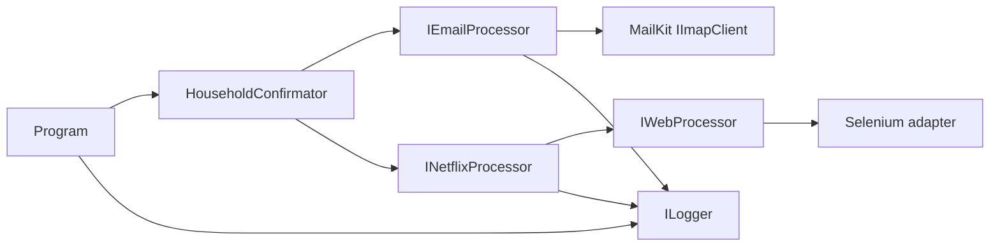

# Development And Operations

## Configuration Contract

The executable copies [appsettings.json](../NetflixHouseholdConfirmator/appsettings.json) to its output directory and binds it once at startup. Configuration changes require a process restart. Typed settings are defined in [Configuration](../NetflixHouseholdConfirmator/Configuration).

| Section | Properties | Runtime effect |
|---|---|---|
| `botSettings` | `pageLoadTimeout` | Browser page-load timeout in seconds. |
| `imapSettings` | `server`, `port`, `username`, `password`, `maxEmailAge` | IMAP endpoint, credentials, and recent-message window. |
| `debugSettings` | `crashScreenshotFileName`, `isDebugMode` | Screenshot filename and visible/headless browser mode. |
| `nuciLoggerSettings` | `minimumLevel`, `logFilePath`, `isFileOutputEnabled` | Logger filtering and file output. |

`DebugSettings.IsHeadless` is the inverse of `IsDebugMode`. A non-blank screenshot filename enables screenshot capture; the screenshot is written beside the configured log file when the host handles a failure.

The repository configuration contains placeholders. Real IMAP credentials must not be committed. The password is passed to MailKit authentication but is not included in the connection `LogInfo`; server, port, and username are logged. Logs and screenshots can still contain sensitive operational context and require filesystem protection and retention management.

## Dependencies And Boundaries

The executable project and package versions are declared in [NetflixHouseholdConfirmator.csproj](../NetflixHouseholdConfirmator/NetflixHouseholdConfirmator.csproj): MailKit for IMAP, Microsoft.Extensions configuration and dependency injection, NuciLog for structured logging, and NuciWeb Selenium adapters for browser automation. The test project is [NetflixHouseholdConfirmator.UnitTests.csproj](../NetflixHouseholdConfirmator.UnitTests/NetflixHouseholdConfirmator.UnitTests.csproj); it uses NUnit, Moq, Microsoft.NET.Test.Sdk, and Coverlet.

The dependency direction is:



Interfaces are substitution seams, not separate processes. Concrete registrations are centralised in `Program.CreateIOC`.

## Local Commands

From the repository root:

```bash
dotnet restore
dotnet build
dotnet test
```

The test suite uses mocks and does not require a live mailbox, Netflix account, browser, or WebDriver. Manual execution requires a compatible browser/WebDriver and network access to the configured IMAP server and Netflix:

```bash
dotnet run --project NetflixHouseholdConfirmator
```

## Release And CI

[release.sh](../release.sh) downloads and executes the maintainer's remote .NET 10 deployment helper. Its behaviour depends on network access and the current contents of that external script; inspect the helper before relying on a release.

No workflow file is present in this checkout. Do not document CI behaviour as locally verified unless a workflow is added or obtained from repository history.

## Operational Constraints

- The process polls continuously without a delay or cancellation mechanism.
- Duplicate suppression is in-memory and resets after restart.
- Multiple running instances have no coordination and can repeat external confirmations.
- Mailbox connection and authentication are startup dependencies.
- Netflix email text, URL format, and page selectors are external compatibility contracts.
- Browser failures are logged but swallowed by `NetflixProcessor`.
- The process has no durable state, health endpoint, metrics, or remote control surface.
- Normal shutdown depends on external process termination; the listener itself has no stop signal.

## Security Boundary

The application authenticates only to the configured IMAP server. It does not request Netflix credentials; it follows a confirmation URL retrieved from email. The most important local security control is protecting [appsettings.json](../NetflixHouseholdConfirmator/appsettings.json) and generated log/screenshot files. Vulnerability reporting instructions are in [SECURITY.md](../SECURITY.md).
