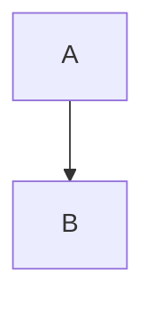

# Documentation Maintenance

## Maintenance Principles

1. **Documentation lives with code** — Update docs in the same PR as code changes
2. **Single source of truth** — Code is authoritative; docs describe code
3. **Review checklist** — Every PR must verify affected docs are updated
4. **Quarterly audit** — Full documentation review every 3 months

## Update Triggers

| Change Type | Docs to Update |
|-------------|----------------|
| New configuration setting | `configuration.md`, `quick-start.md` |
| New dependency | `dependencies.md` |
| New log operation/field | `logging.md` |
| New error type/handling | `error-handling.md` |
| New test pattern | `testing.md` |
| Build/deployment change | `build-and-deployment.md` |
| Architecture change | `architecture.md`, `components/*.md`, `flows/*.md` |
| Behaviour change | `behaviour/*.md` |
| New ambiguity discovered | `ambiguities-and-open-questions.md` |

## Documentation Structure

```
docs/
├── INDEX.md                           # Master index (update on new files)
├── architecture.md                    # System architecture
├── repository-overview.md             # Purpose, scope, entry points
├── repository-structure.md            # Source tree layout
├── configuration.md                   # Configuration schema
├── dependencies.md                    # External/internal dependencies
├── logging.md                         # Logging framework
├── error-handling.md                  # Error taxonomy
├── testing.md                         # Test strategy
├── build-and-deployment.md            # Build pipeline
├── change-guide.md                    # Modification guide
├── quick-start.md                     # Getting started
├── troubleshooting.md                 # Common issues
├── ambiguities-and-open-questions.md  # Known gaps
├── documentation-maintenance.md       # This file
├── api-reference/
│   └── INDEX.md                       # Internal interface reference
├── behaviour/
│   ├── email-processing.md            # IMAP message handling
│   └── browser-confirmation.md        # Netflix page interaction
├── components/
│   ├── presentation.md                # Console host
│   ├── host-and-composition.md        # DI and WebDriver lifecycle
│   ├── application-services.md        # Orchestration and processors
│   └── integration-models.md          # IMAP and browser adapters
├── flows/
│   ├── startup-and-rendering.md       # Process startup
│   └── household-confirmation.md      # End-to-end confirmation flow
├── data-model.md                      # Domain entities
├── state-and-persistence.md           # State management
├── integrations.md                    # External system integrations
├── security.md                        # Security model
├── concurrency-and-scheduling.md      # Threading, async, schedulers
└── faq.md                             # Frequently asked questions
```

## Adding a New Documentation File

1. **Choose correct directory** per structure above
2. **Use kebab-case filename** (e.g., `new-feature.md`)
3. **Follow Markdown conventions:**
   - `#` for file title
   - `##` for major sections
   - Tables for structured data
   - Code blocks with language hints
   - Mermaid diagrams for architecture/flows
4. **Add to `INDEX.md`** in appropriate section
5. **Cross-reference** related documents

## Markdown Conventions

### Headings
```markdown
# File Title (only one per file)
## Major Section
### Subsection
#### Detail
```

### Tables
```markdown
| Column 1 | Column 2 | Column 3 |
|----------|----------|----------|
| Value 1  | Value 2  | Value 3  |
```

### Code Blocks
```markdown
```csharp
// C# code
var x = 1;
```

```json
{
  "key": "value"
}
```

```bash
# Shell commands
dotnet build
```
```

### Cross-References
```markdown
See [Configuration](configuration.md) for details.
See [EmailProcessor](../NetflixHouseholdConfirmator/Service/Processors/EmailProcessor.cs) implementation.
```

### Mermaid Diagrams
```markdown

```

## Review Checklist (Per PR)

- [ ] All changed configuration documented in `configuration.md`
- [ ] New dependencies listed in `dependencies.md`
- [ ] New log operations/fields in `logging.md`
- [ ] Error handling changes in `error-handling.md`
- [ ] Architecture changes in `architecture.md` and relevant `components/`/`flows/`
- [ ] Behaviour changes in `behaviour/`
- [ ] New ambiguities in `ambiguities-and-open-questions.md`
- [ ] `INDEX.md` updated if new files added
- [ ] Cross-references valid (no broken links)
- [ ] Code snippets compile (copy from actual code)

## Quarterly Audit

**Schedule:** First week of each quarter

**Process:**
1. Run link checker: `markdown-link-check docs/**/*.md`
2. Verify all code snippets against current codebase
3. Check `ambiguities-and-open-questions.md` — resolve or update
4. Verify `configuration.md` matches `appsettings.json` template
5. Verify `dependencies.md` matches `csproj` files
6. Update `INDEX.md` "Last Reviewed" date

## Ownership

| Document | Primary Owner | Reviewers |
|----------|---------------|-----------|
| `architecture.md` | Lead Developer | All |
| `configuration.md` | Lead Developer | DevOps |
| `dependencies.md` | Lead Developer | Security |
| `logging.md` | Lead Developer | SRE |
| `error-handling.md` | Lead Developer | All |
| `testing.md` | QA Lead | All |
| `build-and-deployment.md` | DevOps | Lead Developer |
| `behaviour/*.md` | Feature Owner | Lead Developer |
| `components/*.md` | Component Owner | Lead Developer |
| `flows/*.md` | Feature Owner | Lead Developer |

## Tools

- **Link checking:** `markdown-link-check` (npm) or GitHub Actions
- **Spell checking:** `cspell` (VS Code extension or CLI)
- **Formatting:** Prettier with Markdown plugin
- **Diagram rendering:** Mermaid (GitHub, VS Code, MkDocs)

## Versioning

Documentation version matches code version (Git tags). No separate documentation versioning.

## Archive Policy

Obsolete documents moved to `docs/archive/` with date prefix:
```
docs/archive/2024-Q1-old-feature.md
```

Reference from `INDEX.md` with "Archived" label.