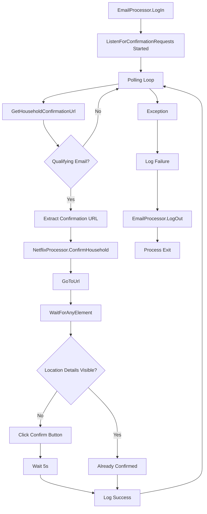

# Household Confirmation Flow

## Overview

End-to-end flow from mailbox polling to browser-based household confirmation.

## Flow Diagram



## Detailed Steps

### 1. IMAP Login (Once at Startup)

```
EmailProcessor.LogIn()
├── Connect(server, port, SSL)
├── Log: EmailLogIn Started {Server, Port}
├── Authenticate(username, password)
├── Log: EmailLogIn InProgress {Server, Port, Username}
├── Log: EmailLogIn Success {Server, Port, Username}
└── Return
```

### 2. Polling Loop (Infinite)

```
while (true)
    confirmationUrl = EmailProcessor.GetHouseholdConfirmationUrl()
    if (confirmationUrl != null)
        NetflixProcessor.ConfirmHousehold(confirmationUrl)
    // NO SLEEP - tight loop!
```

**Critical Issue:** No `Thread.Sleep` → 100% CPU, IMAP hammering

### 3. GetHouseholdConfirmationUrl (Per Iteration)

```
GetHouseholdConfirmationUrl()
├── Search inbox: DeliveredAfter(Now - MaxEmailAge)
├── Fetch summaries (UID, Envelope, BodyStructure)
├── For each message (newest first):
│   ├── Fetch full MimeMessage
│   ├── If Subject.Contains("How to update your Netflix Household"):
│   │   ├── emailDateTime = email.Date.DateTime
│   │   ├── If emailDateTime > lastConfirmationEmailDateTime:
│   │   │   ├── lastConfirmationEmailDateTime = emailDateTime
│   │   │   ├── Extract URL via regex
│   │   │   └── Return URL
│   │   └── Else: Continue (duplicate)
│   └── Else: Continue (non-matching)
└── Return null
```

### 4. ConfirmHousehold (Per URL)

```
ConfirmHousehold(url)
├── Log: HouseholdConfirmation Started
├── GoToUrl(url)
├── WaitForAnyElement(confirmButton, locationDetails)
├── If locationDetails NOT visible:
│   ├── Click(confirmButton)
│   └── Wait(5000)
├── Catch Exception:
│   └── Log: HouseholdConfirmation Failure (swallowed!)
└── Log: HouseholdConfirmation Success (ALWAYS!)
```

### 5. Error Path

```
Any Exception in Loop
├── Log: ListenForConfirmationRequests Failure
├── Throw
└── Finally:
    └── EmailProcessor.LogOut()
        ├── Disconnect
        ├── Dispose
        ├── Log: EmailLogOut Success
        └── (LogOut errors caught and logged separately)
```

## State Management

### In-Memory State

| State | Location | Persistence |
|-------|----------|-------------|
| `lastConfirmationEmailDateTime` | `EmailProcessor` field | Process lifetime only |
| IMAP connection | `EmailProcessor.imapClient` | Process lifetime only |
| WebDriver session | `Program.webDriver` | Process lifetime only |

### No Persistent State

- No database
- No file-based state
- No distributed coordination
- Restart = clean slate

## Timing

| Operation | Typical Duration | Frequency |
|-----------|------------------|-----------|
| IMAP Login | 1-5s | Once |
| Search + Fetch | 0.5-2s | Per iteration |
| Message Fetch (per candidate) | 0.1-0.5s | Per qualifying email |
| Regex Extraction | < 1ms | Per qualifying email |
| Browser Navigation | 2-10s | Per confirmation |
| Element Wait | 1-30s | Per confirmation |
| Click + Wait | 5-10s | Per confirmation (if needed) |
| **Polling Interval** | **0ms (bug)** | **Continuous** |

**Expected with fix:** ~75s polling interval (was hardcoded in original design)

## Error Scenarios

| Scenario | Detection | Handling |
|----------|-----------|----------|
| IMAP connection lost | `ImapProtocolException` in search/fetch | Propagates → LogOut → Process exit |
| Auth expired | `AuthenticationException` | Propagates → LogOut → Process exit |
| No qualifying email | `GetHouseholdConfirmationUrl` returns null | Continue loop |
| Duplicate email | Timestamp check | Skip, continue loop |
| URL extraction fails | Regex returns body | Navigate to body (likely fails) |
| Browser navigation fails | `WebDriverException` in `GoToUrl` | Swallowed, log Success, continue |
| Element not found | `NoSuchElementException` in wait | Swallowed, log Success, continue |
| Click fails | `ElementClickInterceptedException` | Swallowed, log Success, continue |
| Confirmation fails silently | No verification | Log Success, continue |

## Logging Correlation

```
EmailLogIn:Started → EmailLogIn:InProgress → EmailLogIn:Success
ListenForConfirmationRequests:Started
  (per iteration)
  GetHouseholdConfirmationUrl (no dedicated log)
  HouseholdConfirmation:Started → HouseholdConfirmation:Success
  (or HouseholdConfirmation:Failure → HouseholdConfirmation:Success)
ListenForConfirmationRequests:Failure (on exception)
EmailLogOut:Started → EmailLogOut:Success
```

## Configuration Impact

| Setting | Flow Impact |
|---------|-------------|
| `imapSettings.MaxEmailAge` | Search window size |
| `imapSettings.Server/Port` | Connection target |
| `botSettings.PageLoadTimeout` | Browser navigation timeout |
| `debugSettings.IsDebugMode` | Visible vs headless browser |

## Testing Coverage

### Integration Tests (`HouseholdConfirmationIntegrationTests`)

| Test | Flow Coverage |
|------|---------------|
| `GivenANewConfirmationEmail_WhenListening_ThenTheBrowserHandlesTheCurrentPageState` | Full flow with both page states |
| `GivenSuccessiveConfirmationEmails_WhenListening_ThenEveryNewRequestIsOpened` | Multiple URLs |
| `GivenTheSameConfirmationEmailTwice_WhenListening_ThenItIsOpenedOnce` | Duplicate suppression |
| `GivenAnEmptyInbox_WhenListening_ThenTheBrowserIsNotOpened` | Null URL handling |
| `GivenOnlyNonQualifyingEmails_WhenListening_ThenTheBrowserIsNotOpened` | Non-matching emails |
| `GivenAStaleNewestEmail_WhenListening_ThenOlderEmailsAreNotInspected` | Timestamp ordering |
| `GivenMatchingHtmlWithoutAUrl_WhenListening_ThenTheRawBodyIsOpened` | Invalid URL |
| `GivenBrowserNavigationFails_WhenListening_ThenTheNextRequestIsStillOpened` | Navigation failure recovery |
| `GivenABrowserOperationFails_WhenListening_ThenTheFailureIsSwallowedAndTheMailboxIsClosed` | Failure at each browser stage |

### Parameterised Failure Stages

| Stage | Injected Failure | Verified |
|-------|------------------|----------|
| `ElementWaiting` | `WaitForAnyElementToBeVisible` throws | Swallowed, mailbox closed |
| `VisibilityDetection` | `IsElementVisible` throws | Swallowed, mailbox closed |
| `ButtonClicking` | `Click` throws | Swallowed, mailbox closed |
| `PostConfirmationWaiting` | `Wait` throws | Swallowed, mailbox closed |

## Known Flow Defects

1. **No polling delay** — Tight loop consumes 100% CPU
2. **Misleading success logs** — Success logged even after caught exception
3. **No confirmation verification** — Click assumed successful
4. **Swallowed browser exceptions** — Orchestrator unaware of failures
5. **No retry logic** — Transient failures crash process
6. **No graceful shutdown** — Cannot stop cleanly
7. **In-memory duplicate tracking** — Resets on restart
8. **No login handling** — Assumes authenticated browser session