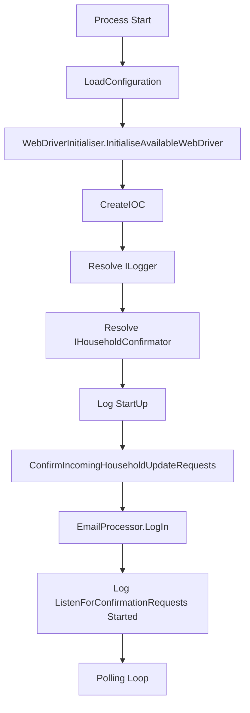

# Startup and Rendering Flow

## Overview

This document describes the process startup sequence, configuration binding, WebDriver initialisation, and DI container composition.

## Flow Diagram



## Step-by-Step

### 1. LoadConfiguration

**Location:** `Program.LoadConfiguration()`

```csharp
botSettings = new BotSettings();
debugSettings = new DebugSettings();
imapSettings = new ImapSettings();
loggerSettings = new NuciLoggerSettings();

IConfiguration config = new ConfigurationBuilder()
    .AddJsonFile("appsettings.json", true, true)
    .Build();

config.Bind(nameof(BotSettings), botSettings);
config.Bind(nameof(DebugSettings), debugSettings);
config.Bind(nameof(ImapSettings), imapSettings);
config.Bind(nameof(NuciLoggerSettings), loggerSettings);
```

**Actions:**
- Instantiate default settings objects
- Build configuration from `appsettings.json` (optional, reload on change)
- Bind each section to corresponding POCO by name

**Outputs:** Four populated settings instances

**Failure Modes:**
- Missing file → defaults used (optional: true)
- Invalid JSON → `JsonException` (uncaught, crashes)
- Missing section → defaults used
- Type mismatch → `ConfigurationBinderException` (uncaught, crashes)

### 2. WebDriver Initialisation

**Location:** `Program.Main()` → `WebDriverInitialiser.InitialiseAvailableWebDriver()`

```csharp
webDriver = WebDriverInitialiser.InitialiseAvailableWebDriver(
    debugSettings.IsDebugMode, 
    botSettings.PageLoadTimeout);
```

**Actions:**
- Detect available WebDrivers (Chrome, Firefox, Edge)
- Configure options:
  - `IsDebugMode=true` → visible browser
  - `IsDebugMode=false` → headless
  - `PageLoadTimeout` → navigation timeout
- Create and return `IWebDriver` instance

**Outputs:** Initialised `IWebDriver` (ChromeDriver, GeckoDriver, or EdgeDriver)

**Failure Modes:**
- No WebDriver found → `InvalidOperationException` ("No WebDriver found")
- Browser version mismatch → `SessionNotCreatedException`
- Missing dependencies (libglib, etc.) → `WebDriverException`

### 3. CreateIOC (DI Container)

**Location:** `Program.CreateIOC()`

```csharp
return new ServiceCollection()
    .AddSingleton(botSettings)
    .AddSingleton(debugSettings)
    .AddSingleton(imapSettings)
    .AddSingleton(loggerSettings)
    .AddSingleton<IEmailProcessor, EmailProcessor>()
    .AddSingleton<ILogger, NuciLogger>()
    .AddSingleton<IWebDriver>(s => webDriver)
    .AddSingleton<IWebProcessor, SeleniumWebProcessor>()
    .AddSingleton<INetflixProcessor, NetflixProcessor>()
    .AddSingleton<IHouseholdConfirmator, HouseholdConfirmator>()
    .BuildServiceProvider();
```

**Actions:**
- Register settings instances as singletons
- Register service implementations as singletons
- Register WebDriver via factory (pre-created instance)
- Build `IServiceProvider`

**Outputs:** `IServiceProvider` with all services registered

**Failure Modes:**
- Missing registration → `InvalidOperationException` at resolve time
- Circular dependency → `InvalidOperationException` at build time

### 4. Service Resolution

**Location:** `Program.Main()`

```csharp
logger = serviceProvider.GetService<ILogger>();
IHouseholdConfirmator service = serviceProvider.GetService<IHouseholdConfirmator>();
```

**Actions:**
- Resolve `ILogger` (NuciLogger)
- Resolve `IHouseholdConfirmator` (HouseholdConfirmator)
- Transitive resolution of all dependencies

**Outputs:** Ready-to-use service instances

### 5. Startup Logging

```csharp
logger.Info(Operation.StartUp, "The service has started.");
```

**Log Entry:**
- Operation: `Operation.StartUp` (NuciLog built-in)
- Message: "The service has started."

### 6. Orchestrator Execution

```csharp
service.ConfirmIncomingHouseholdUpdateRequests();
```

**Delegates to:** `HouseholdConfirmator.ConfirmIncomingHouseholdUpdateRequests()`

**Sub-flow:** See [Household Confirmation Flow](household-confirmation.md)

## Timing

| Step | Typical Duration | Notes |
|------|------------------|-------|
| LoadConfiguration | < 10ms | File I/O + binding |
| WebDriverInitialiser | 2-10s | Browser process launch |
| CreateIOC | < 5ms | Container build |
| Service Resolution | < 5ms | Object graph creation |
| Startup Logging | < 1ms | NuciLog sink write |
| EmailProcessor.LogIn | 1-5s | IMAP connect + auth |

**Total Startup:** ~3-15 seconds (dominated by WebDriver and IMAP)

## Configuration Impact

| Setting | Affects Step |
|---------|--------------|
| `botSettings.PageLoadTimeout` | WebDriver initialisation |
| `debugSettings.IsDebugMode` | WebDriver initialisation (headless vs visible) |
| `imapSettings.*` | EmailProcessor.LogIn (later) |
| `loggerSettings.*` | NuciLogger internal config |

## Error Handling

| Step | Exception | Handling |
|------|-----------|----------|
| LoadConfiguration | `JsonException`, `ConfigurationBinderException` | Uncaught → process crash |
| WebDriverInitialiser | `InvalidOperationException`, `SessionNotCreatedException` | Uncaught → process crash |
| CreateIOC | `InvalidOperationException` | Uncaught → process crash |
| Service Resolution | `InvalidOperationException` | Uncaught → process crash |
| Orchestrator | Any | Caught in Main → Fatal log + screenshot → re-throw |

## Testing

**No automated tests** for startup flow.

**Manual Verification:**
1. Run `dotnet run`
2. Observe console logs for StartUp message
3. Verify browser launches (if debug mode)
4. Verify IMAP connection logs

## Known Issues

1. **No health check** — Cannot verify startup success externally
2. **WebDriver before DI** — Created outside container
3. **No retry** — WebDriver/IMAP failures crash immediately
4. **Static settings** — Not reloadable
5. **No cancellation** — Cannot interrupt startup